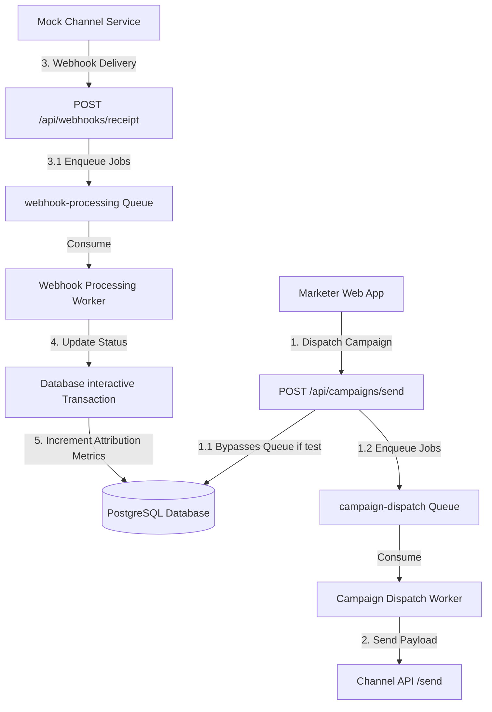

# XENO-INSIGHTS: Developer Map & Architectural Reference (Sprint 3)

This document maps XENO-INSIGHTS modules, data structures, background execution flows, security conventions, and guidelines for developer onboarding.

---

## 1. System Architecture

Below is the message queue and webhook callback architecture introduced in Sprint 3.



---

## 2. Queue Configuration & Workers

All queues utilize `ioredis-mock` for zero-infra, in-memory queueing during local testing and staging environments, minimizing database locking overhead and preventing blocking event loops.

### Queues Defined (`src/config/queue.ts`)
1. **`campaign-dispatch`**: Processes sending promotional campaigns.
2. **`webhook-processing`**: Processes delivery, open, read, and click callbacks.
3. **`nudge`**: Generates and sends personalized customer nudge communications.

### Worker Performance Mappings (`src/config/workers.ts`)
- **Campaign Dispatch Worker**:
  - Concurrency: `5`
  - Retries: `5` attempts with exponential backoff (starting at `1000ms`).
- **Webhook Processing Worker**:
  - Concurrency: `10`
  - Strict precedence check via interactive database transactions to prevent race conditions (e.g. `CLICKED` callback arriving before `DELIVERED`).
- **Nudge Worker**:
  - Concurrency: `3`

---

## 3. Database Schema Overview

```prisma
model Customer {
  id                     String          @id @default(uuid())
  name                   String
  email                  String          @unique
  phone                  String
  totalSpends            Float           @default(0.0)
  lastVisitDate          DateTime?
  loyaltyPoints          Int             @default(0)
  favoriteCategory       String?
  discountSeekingBehavior String?        // HIGH | MID | LOW
  preferredShoppingDay   String?
  preferredCommunication String?         // SMS | EMAIL | WHATSAPP | RCS
  createdAt              DateTime        @default(now())
  updatedAt              DateTime        @updatedAt
  communications         Communication[]
}

model Campaign {
  id                String          @id @default(uuid())
  name              String
  promptText        String?
  messageTemplate   String
  messageTemplateB  String?
  channel           String
  autoSplit         Boolean         @default(false)
  buttons           String?         // JSON stringified array
  imageUrl          String?
  attributedOrders  Int             @default(0)
  attributedRevenue Float           @default(0.0)
  createdAt         DateTime        @default(now())
  communications    Communication[]
}

model Communication {
  id             String      @id @default(uuid())
  customerId     String
  campaignId     String
  channel        String
  status         String      // PENDING | SENT | DELIVERED | OPENED | READ | CLICKED | FAILED
  variant        String      @default("A")
  errorMsg       String?
  createdAt      DateTime    @default(now())
  customer       Customer    @relation(fields: [customerId], references: [id])
  campaign       Campaign    @relation(fields: [campaignId], references: [id])
}
```

---

## 4. Security Hardening Layer

Sprint 3 implements a multi-tiered security layer registered globally in `src/app.ts` to block malicious request injections and enforce size limits.

1. **`requestIdMiddleware`**: Injects a unique Request ID (`X-Request-ID`) using Node's native `crypto.randomUUID()` to enable correlation logging.
2. **`payloadSizeGuard`**: Hard limits request body lengths to `2MB`, returning a `413 Payload Too Large` code if exceeded.
3. **`queryInjectionGuard`**: Scans URL queries and route parameters for database comment sequences (`--`, `/*`) and SQL keywords to reject injection vectors before Prisma or raw query evaluation.
4. **Webhook HMAC-SHA256 Signatures**: Incoming webhooks from external channels verify signatures using the `X-Webhook-Signature` header and `crypto.timingSafeEqual` comparison.

---

## 5. Coding & JSDoc Conventions

Every TypeScript controller or service file must start with a clean JSDoc file block, and all route handlers or auxiliary helper functions require structured description headers:

```typescript
/**
 * @file example.ts
 * @module subfolder/example
 * @description
 * High-level overview of class functionality.
 */

/**
 * @function processData
 * @description Calculates spend metrics and updates database records.
 * @param input {string} Description of param
 * @returns {Promise<boolean>} Output description
 */
```
 
---
 
## 6. Tradeoffs & Future Enhancements
 
### Queue Deferral & Direct Async Mode
 - **Tradeoff**: Queue-based background processing (BullMQ) is currently deferred. Campaign dispatches and customer nudges use direct asynchronous processing paths (`setTimeout` loops), while webhook callbacks process synchronously in database transactions.
 - **Why**: BullMQ's Lua scripts require the `cmsgpack` library which is incompatible with `ioredis-mock`. To guarantee a stable, zero-dependency deployment on Railway and local dev setups without requiring a live Redis infrastructure, the queue pipeline has been safely commented out.
 - **Production Path**: To enable true message queues in production:
   1. Swap the mocked Redis client in `src/config/queue.ts` with a real `ioredis` connection pointing to a production Redis cluster.
   2. Uncomment the queue setup in `src/config/queue.ts`.
   3. Uncomment background worker registrations in `src/config/workers.ts` and the `startAllWorkers()` execution in `src/app.ts`.
   4. Uncomment `.add()` queue enqueues in `src/routes/campaign.ts` and `src/routes/webhook.ts`.

